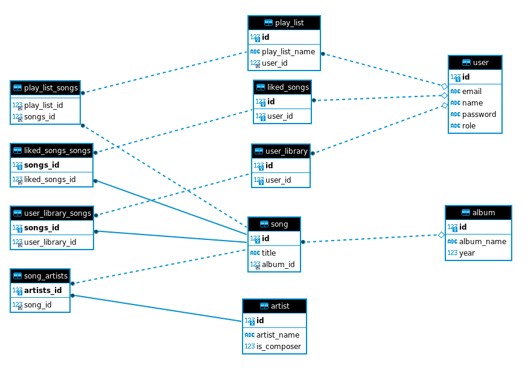
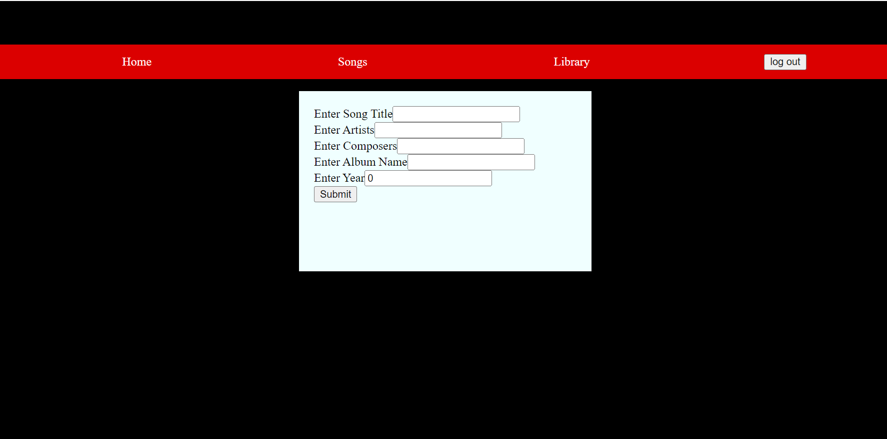

# MusicApp
# Introduction

This application helps users to maintain their favorite music and categorize their favorite songs based on different categories.

The following image shows the ER diagram of our Application

The features we are trying add in this application are:-
1. user can add any number of songs to his library mentioning the song name,artist details,album details
1. user can navigate to different genres, artist, albums and playlist to maintain his song collection.
1. user can also maintain liked songs seperately.

